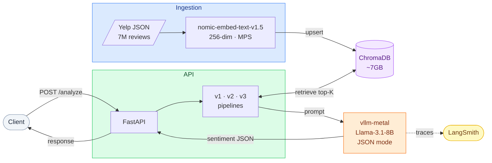

# ReviewDistill

Distills 7M Yelp reviews into structured sentiment and business summaries using a RAG pipeline over a local LLM.

Given a business ID, ReviewDistill retrieves the most signal-rich reviews from ChromaDB, passes them through Llama-3.1-8B-Instruct running on Apple Silicon via vllm-metal, and returns a JSON sentiment breakdown — all with sub-second to low-second latency. Built in three versioned pipeline stages (simple RAG → two-stage aggregation → map-reduce), each benchmarked independently across retrieval quality, LLM output quality, and system performance.

---

## Architecture



### Component Map

```
yelp-rag-summarizer/
├── ingestion/
│   └── ingest.py            # stream → embed → ChromaDB, checkpointed
├── api/
│   ├── main.py              # FastAPI app and routes
│   ├── retriever.py         # ChromaDB queries (shared by all pipelines)
│   ├── schemas.py           # Pydantic request/response models
│   ├── pipeline_v1.py       # retrieve → single LLM call → sentiment
│   ├── pipeline_v2.py       # retrieve → metadata filter → single LLM call → summary + sentiment
│   └── pipeline_v3.py       # retrieve → parallel map → reduce → summary + sentiment
├── benchmarks/
│   ├── ragas_eval.py        # context precision, faithfulness, answer relevancy
│   ├── rouge_eval.py        # ROUGE-L + BERTScore fallback
│   └── load_test.py         # locust p50/p99 load test
├── fixtures/
│   └── sample_reviews.json  # 100-review subset for CI and smoke tests
├── tests/
└── config.py                # all settings via pydantic-settings (.env)
```

---

## Versions

| Version | Pipeline | Output |
|---------|----------|--------|
| **v1** | Retrieve top-50 → single LLM call | Sentiment only |
| **v2** | Retrieve 50 → filter 20 signal-rich (extreme stars) → single LLM call | Summary + Sentiment |
| **v3** | Retrieve 100–200 → parallel map batches → reduce | Summary + Sentiment |

---

## Stack

| Tool | Role |
|------|------|
| FastAPI | Async REST API |
| ChromaDB | Vector store (persistent, local) |
| vllm-metal | LLM inference on Apple Silicon — OpenAI-compatible API, JSON mode |
| openai SDK | HTTP client pointed at vLLM's `/v1` endpoint |
| mlx-embedding-models | MPS-accelerated embedding on M4 Pro |
| LangChain (LCEL) | Pipeline orchestration |
| LangSmith | Automatic LLM call tracing |
| RAGAS | RAG evaluation (context precision, faithfulness, answer relevancy) |
| locust | Load testing (p50/p99) |

**Models**
- Embedding: `nomic-embed-text-v1.5` — 256-dim via Matryoshka truncation (~7GB index)
- Generation: `Llama-3.1-8B-Instruct` — 128K context, ~14GB on 24GB unified memory

---

## Setup

**Requirements:** Python 3.11+, Apple Silicon M-series (or swap vllm-metal for CUDA vLLM on cloud GPU)

```bash
python3 -m venv .venv
source .venv/bin/activate
pip install -r requirements.txt
```

**vllm-metal** (Apple Silicon — not on PyPI, install from source):
```bash
git clone https://github.com/vllm-project/vllm-metal
cd vllm-metal && pip install -e .
```

**Environment** — copy `.env.example` to `.env` and fill in:
```
VLLM_BASE_URL=http://localhost:8001/v1
LANGCHAIN_API_KEY=...
```

---

## Running

**1. Ingest** (one-time, ~2–4 hours on M4 Pro via MPS):
```bash
python -m ingestion.ingest --filepath /path/to/yelp_academic_dataset_review.json
```
Safe to interrupt — resumes from checkpoint.

**2. Start vLLM server:**
```bash
python -m vllm.entrypoints.openai.api_server \
  --model meta-llama/Llama-3.1-8B-Instruct \
  --port 8001
```

**3. Start API:**
```bash
uvicorn api.main:app --port 8000
```

**4. Query:**
```bash
curl -X POST http://localhost:8000/api/v1/analyze \
  -H "Content-Type: application/json" \
  -d '{"business_id": "abc123"}'
```

---

## API

`POST /api/v1/analyze`

```json
// Request
{ "business_id": "abc123" }

// Response (v1)
{
  "sentiment": { "positive": 0.72, "neutral": 0.18, "negative": 0.10 },
  "review_count": 47,
  "latency_ms": 1240
}
```

---

## Benchmark Results

_Results will be added here as each version is benchmarked._

| Metric | v1 | v2 | v3 |
|--------|----|----|-----|
| RAGAS context precision | — | — | — |
| RAGAS faithfulness | — | — | — |
| RAGAS answer relevancy | — | — | — |
| p99 latency (M4 Pro) | — | — | — |
| p99 latency (cloud GPU) | — | — | — |
