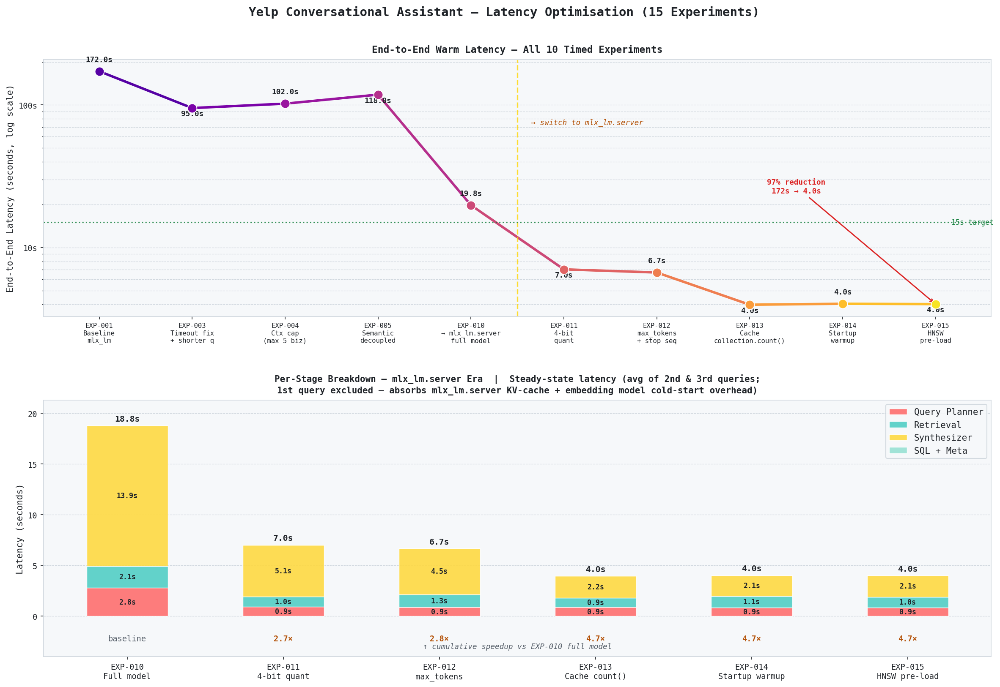

# 🍽️ NOLA Eats — Conversational Restaurant Assistant

> *"Find a jazz brunch spot for a bachelorette party — festive, not touristy."*

A conversational restaurant assistant for New Orleans. Ask natural language questions, get named recommendations backed by actual reviewer quotes — powered by a hybrid of deterministic SQL filtering and semantic vector search over 621K real Yelp reviews.

---

## Demo [UI designed with Claude]

https://github.com/user-attachments/assets/1adddbe5-e89d-4fac-9d1d-1296b5124cd1

---

## ⚙️ How It Works

Two-step pipeline — one deterministic, one semantic:

```
User question
      │
      ▼
┌─────────────────────────────────────────────────────┐
│  Query Planner  (LLM Call 1)                        │
│  Qwen2.5-7B-Instruct-4bit · mlx_lm.server          │
│  question + attribute schema                        │
│    → { sql_filters, semantic_query, intent }        │
└──────────────────────┬──────────────────────────────┘
                       │
           ┌───────────┴───────────┐
           │ sql_filters           │ semantic_query
           ▼                       ▼
┌─────────────────────┐   ┌────────────────────────────────────────┐
│  SQL Filter         │   │  Semantic Retrieval  (retriever.py)    │
│  SQLite             │   │  embed("search_query: " + query)       │
│  1,199 biz          │   │  ChromaDB collection.query(            │
│  → stars >= 4.0     │   │    n_results=top_k=20,                 │
│  → LLM filters      │   │    where={business_id: {$in: pool}}    │
│  → ~30 candidates   │   │  )                                     │
└──────────┬──────────┘   │  → 20 snippets, sorted by distance     │
           │  business_ids └──────────────────┬─────────────────────┘
           └──────────────────────────────────┘
                       │ candidates + snippets
                       ▼
┌─────────────────────────────────────────────────────┐
│  Synthesizer  (LLM Call 2)                          │
│  Qwen2.5-7B-Instruct-4bit · mlx_lm.server          │
│  group snippets by business_id                      │
│  take top 3 per business  (snippets_per_business=3) │
│  cap to top 5 businesses  (max_businesses=5)        │
│  → conversational answer + evidence list            │
└─────────────────────────────────────────────────────┘
                       │
                       ▼
       Named recommendations + review evidence
```

**Step 1 — SQL filter (structured precision).** The Query Planner parses the question into structured filters drawn from Yelp business attributes: noise level, price range, alcohol, outdoor seating, live music, good for groups, ambience, meal type, and more. This shrinks 1,199 restaurants to a precise candidate pool with 100% metadata accuracy.

**Step 2 — Semantic search (review-text ranking).** Within that candidate pool, vector similarity search over 621K embedded review snippets surfaces what no checkbox captures — food quality, atmosphere nuance, experience narratives, local knowledge. The Synthesizer turns the top evidence into a direct conversational answer, grounded only in what reviewers actually wrote.

> The SQL filter achieves deterministic precision before the semantic search runs. Vector search never crosses business boundaries — it operates only within the SQL-filtered candidate pool. This is the industry-standard *filtered vector search* pattern.

---

## 📊 Dataset

| | |
|---|---|
| **Source** | Yelp Open Dataset — `business.json` + `review.json` |
| **Filter** | `city == "New Orleans"`, category contains `"Restaurant"`, `review_count > 50` |
| **Businesses** | 1,199 |
| **Reviews** | ~621K |
| **Ingest time** | ~30–45 min on M4 Pro (MPS) |

**Why New Orleans?** Its semantically rich review vocabulary — Creole, Cajun, po'boys, beignets, jazz brunch, second lines, Frenchmen Street — gives semantic retrieval real signal to work with. A query like *"late-night Cajun spot after a jazz show"* surfaces meaningfully different results than *"casual dinner."* City was selected after inspecting the actual dataset: Las Vegas is absent from this Yelp release.

---

## ⚡ Performance

All results on Apple M4 Pro, `mlx-community/Qwen2.5-7B-Instruct-4bit` via `mlx_lm.server` (MPS).

### Latency

| Stage | Warm |
|---|---:|
| Query Planner | ~880 ms |
| SQL filter | ~3 ms |
| Retrieval | ~900 ms |
| Synthesizer | ~2,200 ms |
| **End-to-end** | **~4,100 ms** |

**Warm p50: ~4.1s** — 3.6× under the <15s target. Achieved across 20 experiments: key wins were switching to a 4-bit quantized model (2.6× speedup), eliminating a redundant per-request ChromaDB scan, and a dummy-query warmup at startup to pre-load the HNSW index into RAM.



### Query Planning Accuracy

20-query eval set covering all three intent types:

| Intent | Result |
|---|---|
| `find_businesses` (14 queries) | 14 / 14 ✓ |
| `question_about_business` (4 queries) | 4 / 4 ✓ |
| `compare_businesses` (2 queries) | 2 / 2 ✓ |
| **Total** | **20 / 20 — 100%** |

Hallucination guard verified: occasion words (`"bachelor party"`, `"date night"`) do not trigger spurious `attire`, `ambience`, or `noise_level` filters.

### Synthesizer Faithfulness

RAGAS faithfulness eval — 14 `find_businesses` queries, judged by Gemini 2.5 Pro. Metric: fraction of answer claims supported by retrieved review evidence.

| | Score |
|---|---:|
| **Mean faithfulness** | **0.831** |
| Queries scoring ≥ 0.80 | 10 / 14 |
| Perfect scores (1.00) | 3 / 14 |

During evaluation, a false negative bias was identified: RAGAS marked business names and SQL-only attributes (e.g. `dogs_allowed`, `byob`) as ungrounded because they never appear in anonymous review text. Fixed by (1) injecting serialised business metadata into the eval context and (2) prefixing each snippet with its business name — giving the judge visibility into both data sources the synthesizer uses. Raw baseline was 0.501; corrected score is 0.831.

### Load Test — 5 concurrent users, 300s

| Metric | Result |
|---|---:|
| Warm p50 | 19,000 ms |
| Warm p95 | 26,000 ms |
| Error rate | **0%** |
| Throughput | 0.18 req/s |

Tested with two `mlx_lm.server` instances behind a round-robin proxy. Latency under concurrent load is queue-induced (serial LLM inference), not pipeline latency — single-user warm p50 remains 4.1s.

---

## 🗂️ SQL Filter Fields

Fields parsed from Yelp business attributes and used as structured filters:

| Type | Fields |
|---|---|
| Scalar | `noise_level`, `price_range`, `alcohol`, `attire`, `wifi`, `smoking` |
| Boolean | `good_for_groups`, `outdoor_seating`, `takes_reservations`, `good_for_kids`, `good_for_dancing`, `happy_hour`, `has_tv`, `caters`, `wheelchair_accessible`, `dogs_allowed`, `byob`, `corkage` |
| JSON sub-keys | `ambience` (romantic/classy/hipster/…), `good_for_meal` (brunch/latenight/…), `music` (live/dj/…), `parking` (garage/valet/…) |

SQL handles *structured, enumerable facts*. Semantic search handles everything that only lives in what reviewers actually wrote.

---

## 🛡️ Security

The Query Planner is an LLM — its output is treated as **untrusted** at the SQL boundary.

- **SQL injection prevention** — LLM-generated field names are validated against explicit whitelists (`_BOOLEAN_FIELDS`, `_SCALAR_FIELDS`, `_JSON_FIELDS`) before any interpolation into SQL strings. JSON sub-keys are checked against per-field allowlists. Unrecognised fields are silently skipped. All values use SQLite parameterised queries — LLM output never touches a SQL string directly.
- **Input validation** — `question` on all request schemas enforces `max_length=2000` to prevent context exhaustion.
- **Session IDs** — generated server-side via `uuid.uuid4()`; unknown IDs start a fresh session rather than erroring.

---

## 🧱 Stack

| Layer | Tool | Detail |
|---|---|---|
| API | FastAPI | REST, `/api/v1/query` |
| Metadata filter | SQLite | Business attributes, indexed |
| Vector store | ChromaDB | 621K review embeddings, persistent local HNSW |
| Embeddings | nomic-embed-text-v1.5 | 256-dim MRL truncation, via mlx-embedding-models (MPS) |
| LLM | Qwen2.5-7B-Instruct-4bit | Query Planner + Synthesizer, single model via mlx_lm.server (MPS) |
| HTTP client | openai SDK | Pointed at mlx_lm.server's OpenAI-compatible `/v1` endpoint |
| Config | pydantic-settings | `.env`-based |

---

## 🚀 Setup

**Requirements:** Python 3.11+, Apple Silicon (M-series)

```bash
python3 -m venv .venv && source .venv/bin/activate
pip install -r requirements.txt
cp .env.example .env          # override LLM_BASE_URL if using a non-default port
```

---

## ▶️ Running

**1. Ingest** (one-time, ~30–45 min on M4 Pro):
```bash
python -m ingestion.ingest_nola \
  --business-file /path/to/yelp_academic_dataset_business.json \
  --review-file /path/to/yelp_academic_dataset_review.json
```

**2. Start LLM server (mlx_lm, Apple Silicon):**
```bash
.venv/bin/mlx_lm.server --model mlx-community/Qwen2.5-7B-Instruct-4bit --port 8001
```

**3. Start API** (separate terminal):
```bash
PYTHONPATH=. .venv/bin/uvicorn api.main:app --port 8000
```

FastAPI startup pre-loads the embedding model and ChromaDB HNSW index before accepting requests — the first query won't absorb cold-start cost. Only the mlx_lm.server KV-cache warmup on the very first LLM call will still show up as cold overhead.

**4. Query:**
```bash
curl -X POST http://localhost:8000/api/v1/query \
  -H "Content-Type: application/json" \
  -d '{"question": "loud spot for a bachelor party that handles large groups"}'
```

**5. Load test** (separate terminal, requires API + LLM server running):
```bash
PYTHONPATH=. .venv/bin/locust -f benchmarks/load_test.py \
  --host http://localhost:8000 \
  --users 5 --spawn-rate 1 --run-time 300s --headless
```

Stats are reported in four rows: `/api/v1/query [cold]`, `/api/v1/query [warm]` (HTTP round-trip), `server [cold]`, `server [warm]` (server-reported `latency_ms` from response body).

**6. RAGAS faithfulness eval** (requires API + LLM server running; `GEMINI_API_KEY` in `.env`):
```bash
# Collect pipeline responses (saves to benchmarks/ragas_samples.json)
PYTHONPATH=. .venv/bin/python benchmarks/ragas_eval.py

# Run Gemini judge on saved samples (no servers needed)
PYTHONPATH=. .venv/bin/python benchmarks/ragas_eval.py --judge-only
```

---

## 🗺️ What's Next

Multi-turn session support — last 3 conversation turns injected into the Query Planner so it can resolve references like *"the first one"*, *"anything cheaper?"*, *"what about parking there?"*. In-memory session store, 30-min TTL.

---

**Example response:**
```json
{
  "answer": "For a bachelor party, Jacques-Imo's is your best bet...",
  "businesses": [
    {
      "name": "Jacques-Imo's Café",
      "stars": 4.3,
      "price_range": 2,
      "evidence": ["Loud rowdy atmosphere, perfect for groups celebrating..."]
    }
  ],
  "query_plan": {
    "intent": "find_businesses",
    "sql_filters": {"noise_level": ["loud", "very_loud"], "good_for_groups": true},
    "semantic_query": "fun lively bachelor party celebration great time"
  },
  "latency_ms": 4100
}
```
