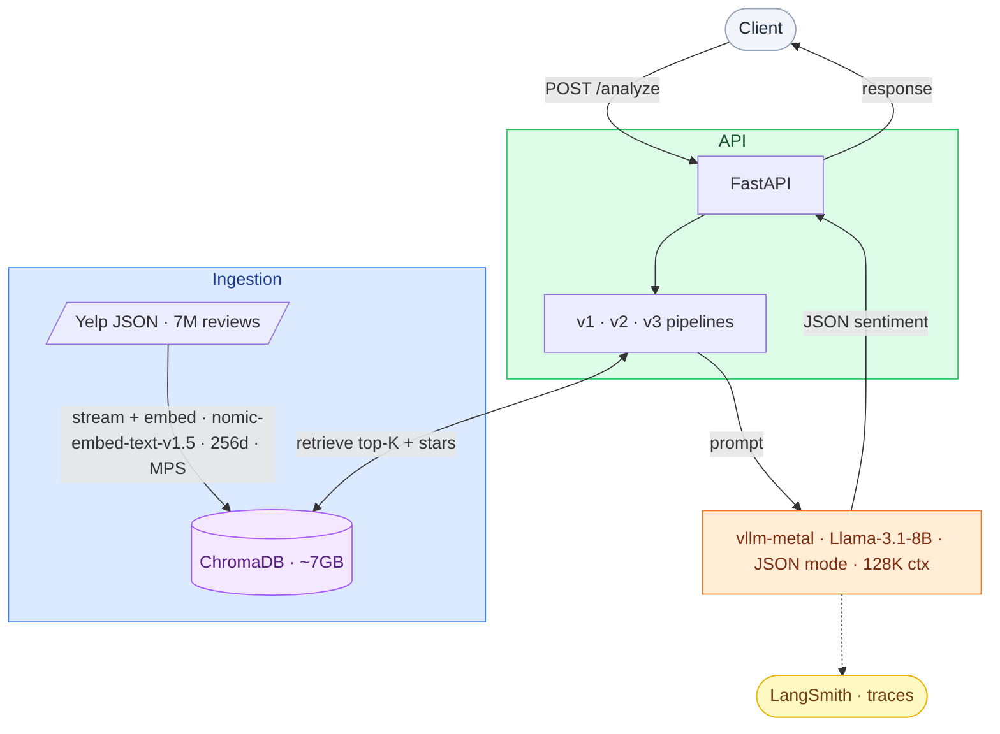

# ReviewDistill

Distills 7M Yelp reviews into structured sentiment and business summaries using a RAG pipeline over a local LLM.

Given a business ID, ReviewDistill retrieves the most signal-rich reviews from ChromaDB, passes them through Llama-3.1-8B-Instruct running on Apple Silicon via vllm-metal, and returns a JSON sentiment breakdown — all with sub-second to low-second latency. Built in three versioned pipeline stages (simple RAG → two-stage aggregation → map-reduce), each benchmarked independently across retrieval quality, LLM output quality, and system performance.

---

## Architecture



### Component Map

```
yelp-rag-summarizer/
├── ingestion/
│   └── ingest.py            # stream → embed → ChromaDB, checkpointed
├── api/
│   ├── main.py              # FastAPI app and routes
│   ├── retriever.py         # ChromaDB queries (shared by all pipelines)
│   ├── schemas.py           # Pydantic request/response models
│   ├── pipeline_v1.py       # retrieve → single LLM call → sentiment
│   ├── pipeline_v2.py       # retrieve → metadata filter → single LLM call → summary + sentiment
│   └── pipeline_v3.py       # retrieve → parallel map → reduce → summary + sentiment
├── benchmarks/
│   ├── ragas_eval.py        # context precision, faithfulness, answer relevancy
│   ├── rouge_eval.py        # ROUGE-L + BERTScore fallback
│   └── load_test.py         # locust p50/p99 load test
├── fixtures/
│   └── sample_reviews.json  # 100-review subset for CI and smoke tests
├── tests/
└── config.py                # all settings via pydantic-settings (.env)
```

---

## Versions

| Version | Pipeline | Output |
|---------|----------|--------|
| **v1** | Retrieve top-50 → single LLM call | Sentiment only |
| **v2** | Retrieve 50 → filter 20 signal-rich (extreme stars) → single LLM call | Summary + Sentiment |
| **v3** | Retrieve 100–200 → parallel map batches → reduce | Summary + Sentiment |

---

## Stack

| Tool | Role |
|------|------|
| FastAPI | Async REST API |
| ChromaDB | Vector store (persistent, local) |
| vllm-metal | LLM inference on Apple Silicon — OpenAI-compatible API, JSON mode |
| openai SDK | HTTP client pointed at vLLM's `/v1` endpoint |
| mlx-embedding-models | MPS-accelerated embedding on M4 Pro |
| LangChain (LCEL) | Pipeline orchestration |
| LangSmith | Automatic LLM call tracing |
| RAGAS | RAG evaluation (context precision, faithfulness, answer relevancy) |
| locust | Load testing (p50/p99) |

**Models**
- Embedding: `nomic-embed-text-v1.5` — 256-dim via Matryoshka truncation (~7GB index)
- Generation (primary): `Llama-3.1-8B-Instruct` — 128K context (capped to 8192, see above), ~14GB on 24GB unified memory
- Generation (comparison): `Qwen2.5-7B-Instruct` — 128K context (capped to 8192), ~12GB on 24GB unified memory; benchmarked alongside Llama to measure quality differences

---

## Setup

**Requirements:** Python 3.11+, Apple Silicon M-series (or swap vllm-metal for CUDA vLLM on cloud GPU)

```bash
python3 -m venv .venv
source .venv/bin/activate
pip install -r requirements.txt
```

**vllm-metal** (Apple Silicon — not on PyPI, install via the official install script):
```bash
curl -fsSL https://raw.githubusercontent.com/vllm-project/vllm-metal/main/install.sh | bash
```
This installs vllm-metal and the vLLM core into `~/.venv-vllm-metal`. Activate it to get the `vllm` CLI:
```bash
source ~/.venv-vllm-metal/bin/activate
```

**Environment** — copy `.env.example` to `.env` and fill in:
```
VLLM_BASE_URL=http://localhost:8001/v1
LANGCHAIN_API_KEY=...
```

---

## Running

**1. Ingest** (one-time, ~2–4 hours on M4 Pro via MPS):
```bash
python -m ingestion.ingest --filepath /path/to/yelp_academic_dataset_review.json
```
Safe to interrupt — resumes from checkpoint.

**2. Start vLLM server:**
```bash
vllm serve meta-llama/Llama-3.1-8B-Instruct \
  --port 8001 \
  --max-model-len 8192 \
  --gpu-memory-utilization 0.95
```

`--max-model-len 8192` and `--gpu-memory-utilization 0.95` are required because Llama-3.1-8B-Instruct weights (~14GB) + ChromaDB HNSW index (~7GB) leave only ~0.5 GiB for KV cache at the default utilization rate on 24GB unified memory. At 0.95 utilization the estimated max context is ~9504 tokens; 8192 is used as a safe ceiling with headroom. Prompt budgets for all three pipeline versions stay within this limit:
- v1: 25 reviews × ~250 tokens avg + prompt overhead ≈ 6.5K tokens
- v2: 20 reviews × ~300 tokens avg + prompt overhead ≈ 6.5K tokens
- v3: batches of 20 reviews per map call ≈ 6.5K tokens per call

To measure actual token lengths on your data:
```python
from transformers import AutoTokenizer
import json

tok = AutoTokenizer.from_pretrained("Qwen/Qwen2.5-7B-Instruct")
reviews = json.load(open("fixtures/sample_reviews.json"))
lengths = [len(tok.encode(r["text"])) for r in reviews]
print(f"min={min(lengths)} max={max(lengths)} avg={sum(lengths)//len(lengths)}")
```

**3. Start API:**
```bash
uvicorn api.main:app --port 8000
```

**4. Query:**
```bash
curl -X POST http://localhost:8000/api/v1/analyze \
  -H "Content-Type: application/json" \
  -d '{"business_id": "abc123"}'
```

**5. Run load test:**
```bash
locust -f benchmarks/load_test.py --host http://localhost:8000 \
  --users 5 --spawn-rate 1 --run-time 300s --headless
```

---

## API

`POST /api/v1/analyze`

```json
// Request
{ "business_id": "abc123" }

// Response (v1)
{
  "sentiment": { "positive": 0.72, "neutral": 0.18, "negative": 0.10 },
  "review_count": 47,
  "latency_ms": 1240
}
```

---

## Benchmark Results

_Each metric is reported per model where applicable. Load tests run with locust, 5 concurrent users, 300s window, fixture dataset (20 reviews across 2 businesses)._

### Llama-3.1-8B-Instruct

| Metric | v1 | v2 | v3 |
|--------|----|----|-----|
| RAGAS context precision | — | — | — |
| RAGAS faithfulness | — | — | — |
| RAGAS answer relevancy | — | — | — |
| p50 latency (M4 Pro) | 9,900ms | — | — |
| p99 latency (M4 Pro) | 28,000ms | — | — |
| min latency (M4 Pro, warm) | 7,987ms | — | — |
| avg latency (M4 Pro) | 10,649ms | — | — |
| req/s (M4 Pro, 5 users) | 0.39 | — | — |
| p99 latency (cloud GPU) | — | — | — |

### Qwen2.5-7B-Instruct

| Metric | v1 | v2 | v3 |
|--------|----|----|-----|
| RAGAS context precision | — | — | — |
| RAGAS faithfulness | — | — | — |
| RAGAS answer relevancy | — | — | — |
| p50 latency (M4 Pro) | 9,200ms | — | — |
| p99 latency (M4 Pro) | 42,000ms | — | — |
| min latency (M4 Pro, warm) | 8,179ms | — | — |
| avg latency (M4 Pro) | 10,432ms | — | — |
| req/s (M4 Pro, 5 users) | 0.40 | — | — |
| p99 latency (cloud GPU) | — | — | — |

_The p99 jump from ~9.5s to 42s is purely queue depth — requests pile up while one is being processed. This is expected with a synchronous LLM call and a single vLLM thread._

---

## Setup Notes — Issues Encountered

### 1. KV cache OOM (Qwen2.5-7B-Instruct)
Qwen weights (~12GB) leave enough headroom on 24GB unified memory for `--max-model-len 16384` at `--gpu-memory-utilization 0.95` without OOM. No workaround needed.

### 2. KV cache OOM (Llama-3.1-8B-Instruct)
Llama weights are ~16GB vs ~12GB for Qwen, leaving essentially no KV cache budget even at `gpu-memory-utilization 0.95`. Fixed by adding `VLLM_METAL_MEMORY_FRACTION=0.97` — a vllm-metal-specific env var that controls Metal allocator headroom independently of the standard vLLM flag.

### 3. xgrammar FSM failures with JSON mode
`response_format={"type": "json_object"}` triggered repeated xgrammar FSM token rejections with Llama's tokenizer on vllm-metal. The `--guided-decoding-backend` flag is not available in this vllm-metal build. Fixed by removing `response_format` entirely and relying on prompt-only JSON instructions.

### 4. Llama wrapping JSON output in markdown fences
Without `response_format` enforcement, Llama wraps responses in ` ```json ... ``` ` blocks and appends explanation text. Fixed with an `_extract_json` helper in `pipeline_v1.py` that strips markdown fences before `json.loads()`.

### 5. Async FastAPI route blocking event loop
`async def` route calling a sync blocking `analyze_v1()` (which makes a blocking HTTP call to vLLM) caused the entire event loop to serialize all requests. Under 5 concurrent users, all requests queued behind each other and none completed within the 60s test window. Fixed by changing the route to `def` — FastAPI runs sync routes in a thread pool, allowing concurrent request acceptance.
